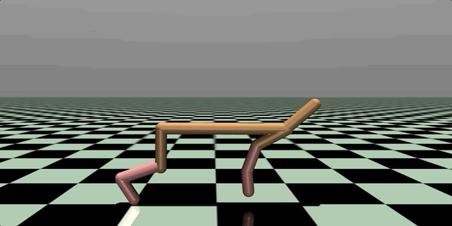

# Reinforcement Learning

### Environment
To set up the environment for mujoco, refer to https://github.com/openai/mujoco-py/

For atari games:
```bash
pip install gym[atari]==0.19.0
```

### Train
Use the following command to train an agent:
```bash
# policy-based
python run.py --env HalfCheetah-v2 --type policy --total_steps 3000000 --train
# value-based
python run.py --env BoxingNoFrameskip-v4 --type value --dueling --total_steps 10000000 --train
```
Type ```python run.py --help``` in the terminal for more information on all the training arguments

### Evaluate
Test existing agents:
```bash
# policy-based
python run.py --env Humanoid-v2 --type policy --eval --model models/DDPG_actor_Humanoid-v2.pickle
# value-based
python run.py --env BoxingNoFrameskip-v4 --type value --eval --model models/DQN_model_BoxingNoFrameskip-v4.pickle
```

### Demo (to be updated)
- Humanoid


- Ant


- Hopper


- Half Cheetah




